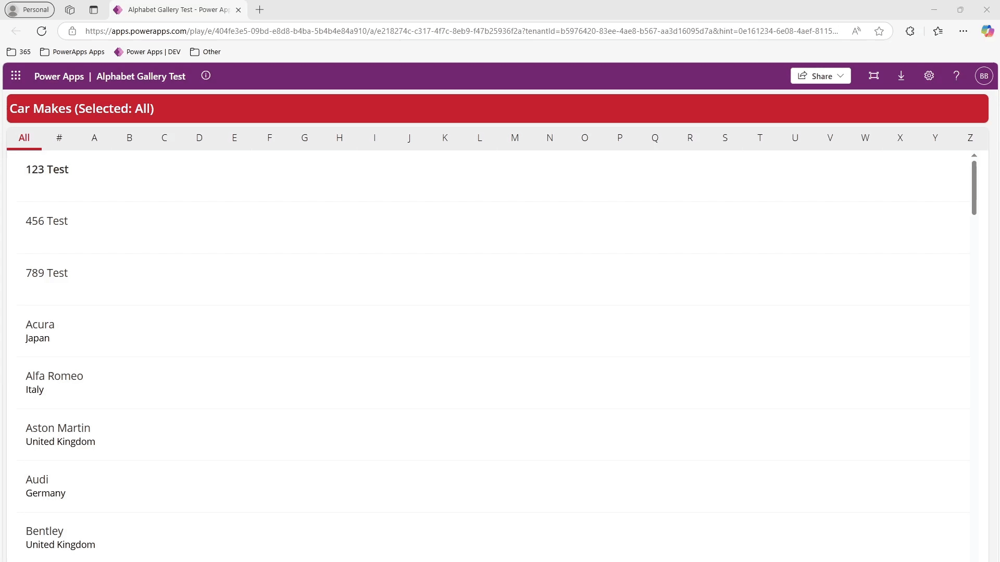

# Alphabet Gallery Selector

## Description

This Canvas App Component, built using PowerFx code, allows the user to select a letter, which then filters a datasource for items starting with that letter. The component is responsive and supports both horizontal and vertical orientations. 

Per Micorosoft's best practice, It is recommended that you import this component into a component library as opposed to a local component in an individual app.

Original blog post for this solution was written [here](https://www.openai.com).

### Component Property Details

The table below explains the various input properties you can customize in the component.

| Property Name               | Type   | Description                                                                 |
|-----------------------------|--------|-----------------------------------------------------------------------------|
| **Filter Numbers**           | Boolean| If enabled, show "#" for use in filtering by numbers, else hide.            |
| **Orientation is Vertical** | Boolean| Indicates whether the component should display vertically or horizontally. |
| **Use Banded Rows**         | Boolean| Enabling adds a banded rows effect in the gallery alternating between Banded Row Color 1 and Banded Row Color 2. |
| **Hover Fill Color**        | Color  | The color when the letter is hovered over.                                   |
| **Banded Row Color 1**      | Color  | Color used in the gallery background.                                        |
| **Banded Row Color 2**      | Color  | Secondary Color used in the gallery background (only visible if banded rows is enabled). |
| **GalleryFill**             | Color  | The background color of the gallery. This will be visible only if banded rows is disabled. |
| **Font Style**              | Text   | Font Style used.                                                             |
| **Font Size**               | Number | Size of the font.                                                           |
| **Primary Color**           | Color  | Main Color visible when selecting a letter.                                 |

## Installation Instructions

1. Within the Canvas App Studio, be sure the "Export and import components" feature is enabled under Settings > Updates > Retired
2. Download the component .msapp file to your local system.
3. Within your Component Library or Canvas App go to Components > Import Components 
4. Choose the Upload File option and upload the .msapp file
5. Enjoy!
