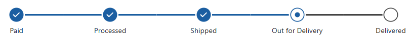
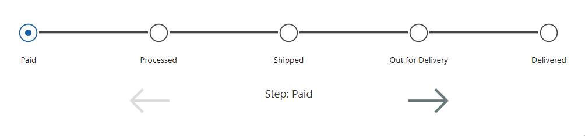

# Purpose

This component, created using **Power Fx**, mimics the **Business Process Flow Timeline step control** inside a Canvas App.  
It allows users to step through various stages, moving the flow bar forward or backward.  
The component uses SVGs to indicate when a step is **Not Started**, **Active**, or **Completed**.



---

# How to Use

## Custom Properties

- **Table Data**  
  A table/collection representing the flow bar step navigation items. Refer to the schema example below.

- **Active Step Image**  
  SVG image used for the *active* step.

- **In Progress Image**  
  SVG image used for a step that is *in progress*.

- **Complete Image**  
  SVG image used for a *completed* step.

- **Active Step**  
  The current active step.

- **ColorTheme**  
  A record containing hex colors for the primary color and gray.

- **Font Size**  
  Font size used for the step labels.

---

# Example



## 1. Create the Table Data Collection and Active Stage Variable

```powerfx
ClearCollect(
    colNav,
    Table(
        {
            Stage: 1,
            Title: "Paid",
            IsComplete: false
        },
        {
            Stage: 2,
            Title: "Processed",
            IsComplete: false
        },
        {
            Stage: 3,
            Title: "Shipped",
            IsComplete: false
        },
        {
            Stage: 4,
            Title: "Out for Delivery",
            IsComplete: false
        },
        {
            Stage: 5,
            Title: "Delivered",
            IsComplete: false
        }
    )
);

Set(varActiveStageId, First(colNav).Stage);
```

---

## 2. Bind Properties

- **Table Data** → `colNav`  
- **Active Step** → `LookUp(Self.TableData, Stage = varActiveStageId)`

---

## 3. Add Navigation Icons

Add left/right arrow icons in your app.  
Their **OnSelect** actions will move the progress bar forward or backward.

---

## 4. Move Step Forward

```powerfx
Set(
    varActiveStageId,
    varActiveStageId + 1
);

UpdateIf(
    colNav,
    Stage < varActiveStageId,
    { IsComplete: true }
);
```

---

## 5. Move Step Backward

```powerfx
Set(
    varActiveStageId,
    If(
        varActiveStageId = Max(colNav, Stage) + 1,
        varActiveStageId - 2,
        varActiveStageId - 1
    )
);

UpdateIf(
    colNav,
    Stage >= varActiveStageId,
    { IsComplete: false }
);
```

---

## DisplayMode Logic

### Left Arrow

```powerfx
If(
    varActiveStageId = 1,
    DisplayMode.Disabled,
    DisplayMode.Edit
)
```

### Right Arrow

```powerfx
If(
    varActiveStageId = Max(colNav, Stage) + 1,
    DisplayMode.Disabled,
    DisplayMode.Edit
)
```