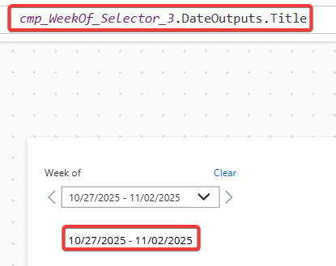
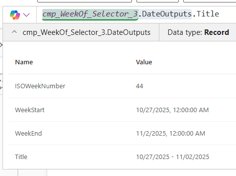

# Week of Selector

## Description

This Canvas App Component, built using Power Fx code, gets the current week of and allows selection to move forwards or backwards to the previous week.

## Tips

1. Customize the Date Format output under the Date Format Text Parameter    
2. The ShowHeader Parameter will show/hide the header which includes the reset button in cases where you want to component to take up less room
3. Selecting the component outputs such as cmp_WeekOf_Selector_3.DateOutputs will contain a record output of the current Week of, ISO WeekNumber, Week Start and Week End date.

