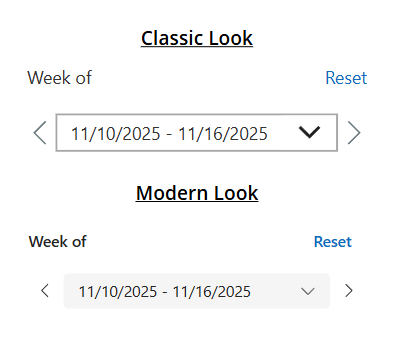
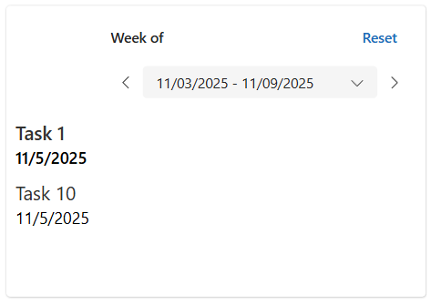

# Week Of Selector

## Description

The **Week Of Selector** is a Canvas App Component built using Power Fx. It determines the current “week of” (based on the week start date) and allows users to navigate forward or backward through weeks.

Two downloadable versions are included:  
- **Classic controls**  
- **Modern controls** (recommended for improved theming and styling)

Both versions have the same functionality—the difference is purely visual.



---

## Component Custom Property Details

1. **Date Format**  
   Customize the date output using the **Date Format Text** parameter.  
   The default format is `"m/dd/yyyy"`.

2. **Show Header**  
   Use the **ShowHeader** parameter to toggle the header visibility (including the reset button).  
   This is helpful when you need the component to take up less space.

3. **Event Actions**  
   The **Next Week** and **Prior Week** actions expose *OnSelect* events you can use to trigger additional logic when the user navigates weeks.

4. **Component Outputs**  
   The component provides values through the `.DateOutputs` record, including:  
   - `Title`  
   - `ISOWeekNumber`  
   - `WeekStart`  
   - `WeekEnd`  

   Example:  
   `cmp_WeekOf_Selector_3.DateOutputs.WeekStart`


---

## Example Use Case

Suppose you have a randomly generated collection of tasks with due dates for the current month:

```powerfx
ClearCollect(
    colTasks,
    ForAll(
        Sequence(10),
        {
            ID: Value,
            Title: "Task " & Value,
            DueDate: DateAdd(
                Date(
                    Year(Today()),
                    Month(Today()),
                    1
                ),
                RandBetween(
                    0,
                    Day(
                        DateAdd(
                            Date(Year(Today()), Month(Today()) + 1, 1),
                            -1
                        )
                    ) - 1
                ),
                TimeUnit.Days
            )
        }
    )
);
```

Create a gallery bound to colTasks, then filter it using the component's date outputs:

```powerfx
Sort(
    Filter(
        colTasks,
        DueDate >= cmp_Date_WeekOf_Modern_1.DateOutputs.WeekStart && DueDate <= cmp_Date_WeekOf_Modern_1.DateOutputs.WeekEnd
    ),
    DueDate
)
```

Result: Only tasks whose due dates fall within the currently selected week will be displayed.

