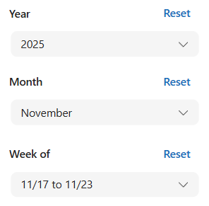

# Overview

The **Year Month Week Of** component is built using **Power Fx** and allows users to filter time-based data by **year**, **month**, and **week of**.  
All date calculations are performed dynamically based on the custom properties selected.

The outputs of the component generate a Table of dates within the Week of range which then can be used for filtering against other data sources.

---

# Custom Properties

- **Starting Year**  
  Specifies the starting year for filtering.

- **Ending Year**  
  Specifies the ending year for filtering.

- **Default Year**  
  Defaults to the current year (used for the Year dropdown).

- **Default Month**  
  Defaults to the current month (used for the Month dropdown).

- **Week Start Day**  
  Specifies the starting day of the week (default: Monday).
