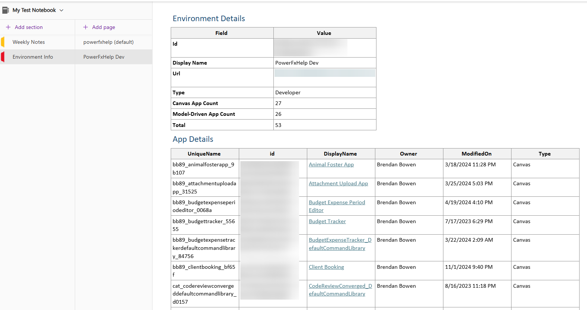
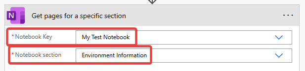
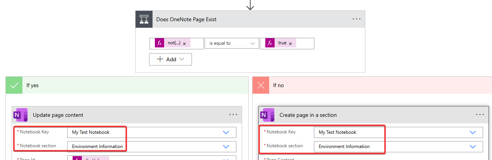

# Fetch a List of PowerApps across Environments

## Description

The purpose of this Power Automate  is to gather both Canvas and Model Driven App information and output to OneNote for documentation purposes. It uses the Dataverse Tables that house Canvas and Model Driven App information, formats the data into HTML and outputs it to an OneNote Page for each environment.

This topic was written about on my blog Power Right Solutions [here](https://powerrightsolutions.com/fetch-powerapps-across-environments).

## Requirements

1. The owner of the Power Automate flow must have the **System Administrator** security role in each target environment to retrieve Power Apps environment information.
    -  Given it's admin level permission nature, be cautious about which account you assign this role to.
2. A PowerApps or Power Automate Premium License

### Installation Instructions

1. Download the [ZIP Package](GetCanvasandModelDrivenAppInfo_20250630225304.zip)
2. Edit the Recurrence schedule trigger to the values of your choosing (default is set to once a month).
3. Open the solution editor for the flow. Edit the following OneNote Actions
4. Edit the Notebook key and Note section values in the OneNote Action: "Get pages for a specific section"
    - 
5. Within the Apply to Each - under the Condition "Does OneNote Page Exist", update the "Update Page Content" and "Create page in a section" with the values you entered in the prior step.
    - 
6. Save the flow and enjoy!

