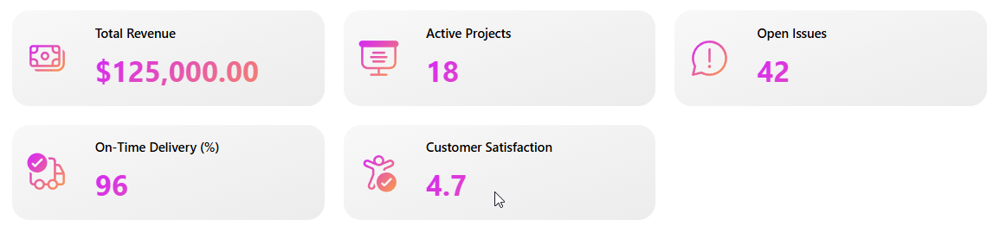
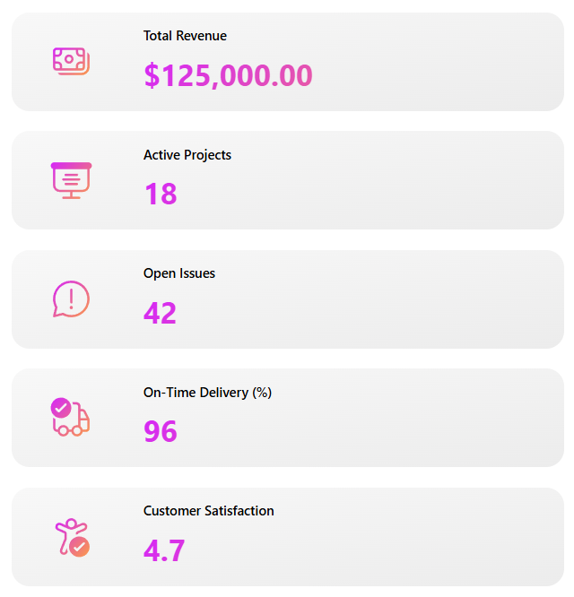

# KPI Responsive Gallery Cards

## Description

This component features KPI data cards displayed in a responsive gallery layout. It includes subtle SVG gradient images for both the background and the icons. In addition, an HTML control is used to render the KPI value with a matching gradient text effect.

### Component Property Details

The table below explains the customizable input properties available in the component.

| Property              | Type    | Description                                              |
|-----------------------|---------|----------------------------------------------------------|
| ColorTheme            | Record  | Contains the colors used for the theme                  |
| KPI Items             | Table   | The collection of KPI items                             |
| Background Image      | Image   | The SVG gradient background image                       |
| Title Font Size       | Number  | The font size of the title                              |
| Value Font Size       | Number  | The font size of the value                              |
| Show Icon             | Boolean | Shows or hides the SVG icons                            |
| Card Template Height  | Number  | The gallery template height of each card                |

### Intallation Details

1. Download the msapp file and import the component file into your Canvas App or Global Component Library
2. If needed, change the Width property to Parent.Width and Height to Parent.Height
3. Update the KPI Items property with data that matches the default schema  

