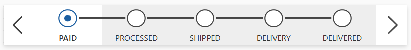
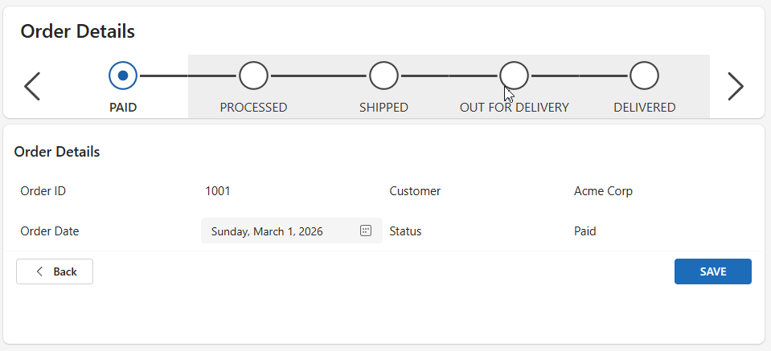

# Purpose

This component, created using **Power Fx**, was inspired by the **Business Process Flow Progress Stage Control** found in model driven apps.  
This canvas app component allows users to step through various stages, moving the timeline forward or backward.  
The component uses SVGs to indicate when a step is **Not Started**, **Active**, or **Completed** or **Finished** in the case of the last stage. Practical use-cases can be for multi step forms and more complex data entry processes where items may sit at a certain stage for a period of time.



An example with an ordering process timeline



## Custom Input Properties

| Property             | Type    | Description                                              |
|----------------------|---------|----------------------------------------------------------|
| Table Data           | Table   | A table/collection representing the flow bar step navigation items. |
| Active Step Image    | Image   | SVG image used for the *active* step.                   |
| In Progress Image    | Image   | SVG image used for a step that is *in progress*.       |
| Complete Image       | Image   | SVG image used for a *completed* step.                 |
| Active Step          | Number  | The current active step.                                |
| Finished Image       | Image   | SVG image used for a *finished* step.                  |
| ColorTheme           | Record  | Contains hex colors for the primary color and gray.     |
| Font Size            | Number  | Font size used for the step labels.                     |
| Active Stage Number  | Number  | The number of the active stage.                         |
| Output Stage         | Record  | The record of the currently selected stage.            |

# How to Use

## 1. Create the Table Data Collection and Active Stage Variable on your OnStart app code

Provided below is a sample collection to use.

```powerfx
ClearCollect(
    colStages,
    Table(
        {
            Stage: 1,
            Title: "Paid"
        },
        {
            Stage: 2,
            Title: "Processed"
        },
        {
            Stage: 3,
            Title: "Shipped"
        },
        {
            Stage: 4,
            Title: "Out for Delivery"
        },
        {
            Stage: 5,
            Title: "Delivered"
        }
    )
);
Set(
    varCurrentStage,
    1
)
```

---

## 2. Import the Component

Under Tree view, Go to Components > Import Components, and the upload the msapp file

## 3. Set the Following Custom Properties

- **Table Data** → `colNav`  
- **Active Stage Number** → `varCurrentStage`

---

## 4. Set the OnNextStage and OnPriorStage Events Properties

Locate the "OnNextStage" Property and set to the following:

```powerfx

Set(
    varCurrentStage,
    Min(
        varCurrentStage + 1,
        CountRows(Self.TableData)
    )
)
```

Do the same with the "OnPriorStage"

```powerfx
Set(
    varCurrentStage,
    Max(
        varCurrentStage - 1,
        1
    )
)
```