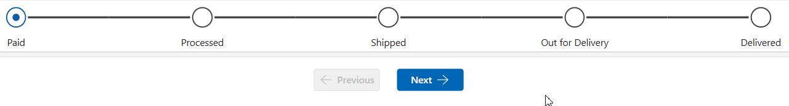

# Purpose

This component, created using **Power Fx**, was inspired by the **Business Process Flow Timeline step control** found in model driven apps.  
This canvas app component allows users to step through various stages, moving the timeline forward or backward.  
The component uses SVGs to indicate when a step is **Not Started**, **Active**, or **Completed**. Practical use-cases can be for multi step forms and more complex data entry processes where items may sit at a certain stage for a period of time.



---

# How to Use

## Custom Input Properties

- **Table Data**  
  A table/collection representing the flow bar step navigation items. Refer to the schema example below.

- **Active Step Image**  
  SVG image used for the *active* step.

- **In Progress Image**  
  SVG image used for a step that is *in progress*.

- **Complete Image**  
  SVG image used for a *completed* step.

- **Active Step**  
  The current active step.

- **ColorTheme**  
  A record containing hex colors for the primary color and gray.

- **Font Size**  
  Font size used for the step labels.

- **Active Stage Number**  
  The Number of the Active Stage
---

# How to Use

## 1. Create the Table Data Collection and Active Stage Variable on your OnStart app code

```powerfx
ClearCollect(
    colStages,
    Table(
        {
            Stage: 1,
            Title: "Paid"
        },
        {
            Stage: 2,
            Title: "Processed"
        },
        {
            Stage: 3,
            Title: "Shipped"
        },
        {
            Stage: 4,
            Title: "Out for Delivery"
        },
        {
            Stage: 5,
            Title: "Delivered"
        }
    )
);
Set(
    varStage,
    1
)
```

---

## 2. Import the Component

Under Tree view, Go to Components > Import Components, and the upload the msapp file

## 3. Bind Properties to the component

- **Table Data** → `colNav`  
- **Active Stage Number** → `varStage`

---

## 4. Add Navigation Buttons

Add two buttons for next and previous in your app. I use the modern buttons here. 
Their **OnSelect** actions will move the progress bar forward or backward.

| Button | Property / Action | Code |
|--------|-------------------|------|
| Next Button | OnSelect | `Set(varStage, varStage + 1)` |
| Previous Button | OnSelect | `Set(varStage, varStage - 1)` |
| Previous Button | DisplayMode | `If(varStage = Min(cmp_HorizontalTimeline.TableData, Stage), DisplayMode.Disabled, DisplayMode.Edit)` |
| Previous Button | Text | `"Previous"` |
| Previous Button | Icon | `"ArrowLeft"` |
| Next Button | DisplayMode | `If(varStage = Max(cmp_HorizontalTimeline.TableData, Stage) + 1, DisplayMode.Disabled, DisplayMode.Edit)` |
| Next Button | Text | `If(varStage = Last(colStages).Stage \|\| varStage = Last(colStages).Stage + 1, "Finish", "Next")` |
| Next Button | Icon | `If(varStage = Last(colStages).Stage \|\| varStage = Last(colStages).Stage + 1, "Checkmark", "ArrowRight")` |
| Next Button | Color Palette | `If(varStage = Last(colStages).Stage \|\| varStage = Last(colStages).Stage + 1, RGBA(8,222,8,1), App.Theme.Colors.Primary)` |