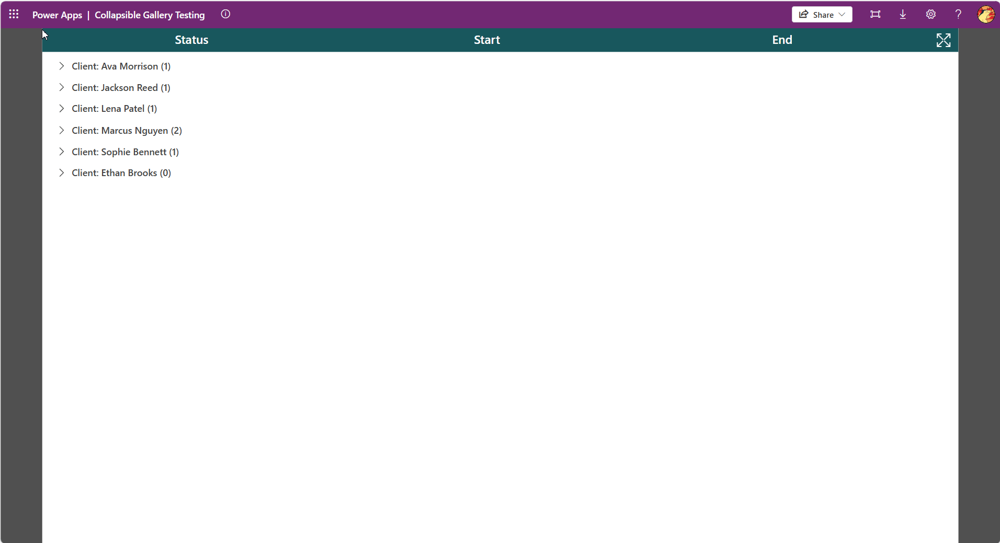

# Nested (Accordion) Gallery

## Description

This YAML configuration defines a **nested parent-child gallery** for displaying related records (for example, a *Client* with multiple *Bookings*).  
The gallery supports both **expand/collapse all** functionality and **individual row expansion** to show child items for the selected parent record.

## Usage Instructions

1. **Set the Parent Gallery (`galParent`) Items property**  
   Replace the sample data with a single-column record table representing the parent dataset.

2. **Configure the Child Gallery (`galChild`) Items property**  
   - Update the table reference inside the `With()` function.  
   - Ensure the parent lookup value exists in the table (e.g., a Client reference).  
   - Modify the `Filter()` function to match the correct relationship property (for example:  
     `Filter(DATA, Client = Parent.Client)`).

3. **Adjust Styling and Formatting**  
   Customize colors, borders, icons, and layout as needed to match your app’s design.
