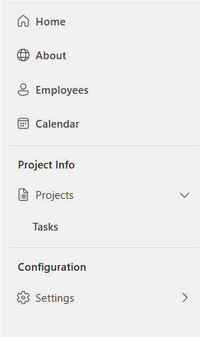

## Description

This YAML configuration produces a gallery of the fluent 2 ui modern navigation control as a left navigation menu
The navigation is broken down by Buttons, Dividers, Dropdowns (for child items under parent) and Categories

## Usage Instructions

1. Copy/Paste the yaml code into your PowerApp
2. Change the galNavigation items to a table structure using the explantion below



Example Menu Schema:
```json
Button:
{
    ItemKey: "Text",
    ItemDisplayName: "Text",
    ItemIconName: "Text", //See the Button control's icon property for a full list of Fluent 2 Icons
    ItemScreen: Screen,
    ItemType: "Button",
    ItemOpen: false, //Can be set to true to have an item opened by default upon loading the app
    ItemParentKey: "Text", //ItemKey of a parent item if this button should appear under a dropdown
    ItemVisible: true //Can be set to true or false using formulas to hide buttons dynamically
}

Divider:
{
    ItemKey: "Text",
    ItemType: "Divider"
}

Category:
{
    ItemKey: "Text",
    ItemDisplayName: "Text",
    ItemType: "Category"
}

Dropdown:
{
    ItemKey: "Text",
    ItemDisplayName: "Text",
    ItemIconName: "Text", //See the Button control's icon property for a full list of Fluent 2 Icons
    ItemScreen: Blank(), //Should always be blank for dropdowns. No navigation occurs when clicking dropdown
    ItemType: "Dropdown",
    ItemOpen: false, //Set this to true if dropdown should be open by default
    ItemParentKey: Blank(), //Should always be blank for dropdowns.
    ItemVisible: true //Can be set to true or false using formulas to hide buttons dynamically  
}
```

ClearCollect(
    colNav,
    {
        ItemKey: "home",
        ItemDisplayName: "Home",
        ItemIconName: "Home",
        ItemScreen: App.ActiveScreen,
        ItemType: "Button",
        ItemOpen: false,
        ItemParentKey: Blank(),
        ItemVisible: true
    },
    {
        ItemKey: "about",
        ItemDisplayName: "About",
        ItemIconName: "Globe",
        ItemScreen: About,
        ItemType: "Button",
        ItemOpen: false,
        ItemParentKey: Blank(),
        ItemVisible: true
    },
    {
        ItemKey: "employees",
        ItemDisplayName: "Employees",
        ItemIconName: "Person",
        ItemScreen: Employee,
        ItemType: "Button",
        ItemOpen: false,
        ItemParentKey: Blank(),
        ItemVisible: true
    },
    {
        ItemKey: "calendar",
        ItemDisplayName: "Calendar",
        ItemIconName: "Calendar",
        ItemScreen: App.ActiveScreen,
        ItemType: "Button",
        ItemOpen: false,
        ItemParentKey: Blank(),
        ItemVisible: true
    },
    {
        ItemKey: "Text",
        ItemType: "Divider"
    },
    {
        ItemKey: "projectsinfo",
        ItemDisplayName: "Project Info",
        ItemType: "Category"
    },
    {
        ItemKey: "project",
        ItemDisplayName: "Projects",
        ItemIconName: "DocumentBulletList",
        ItemScreen: App.ActiveScreen,
        ItemType: "Dropdown",
        ItemOpen: false,
        ItemParentKey: Blank(),
        ItemVisible: true
    },
    {
        ItemKey: "tasks",
        ItemDisplayName: "Tasks",
        ItemIconName: "AppsListDetail",
        ItemScreen: App.ActiveScreen,
        ItemType: "Button",
        ItemOpen: false,
        ItemParentKey: "project",
        ItemVisible: true
    },
    {
        ItemKey: "Text2",
        ItemType: "Divider"
    },
    {
        ItemKey: "configuration",
        ItemDisplayName: "Configuration",
        ItemType: "Category"
    },
    {
        ItemKey: "settings",
        ItemDisplayName: "Settings",
        ItemIconName: "Settings",
        ItemScreen: App.ActiveScreen,
        ItemType: "Dropdown",
        ItemOpen: false,
        ItemParentKey: Blank(),
        ItemVisible: true
    },
    {
        ItemKey: "permissions",
        ItemDisplayName: "Permissions",
        ItemIconName: "AppsListDetail",
        ItemScreen: App.ActiveScreen,
        ItemType: "Button",
        ItemOpen: false,
        ItemParentKey: "settings",
        ItemVisible: true
    }
);


### References 

https://www.youtube.com/watch?v=ahXuUEj9ZVI